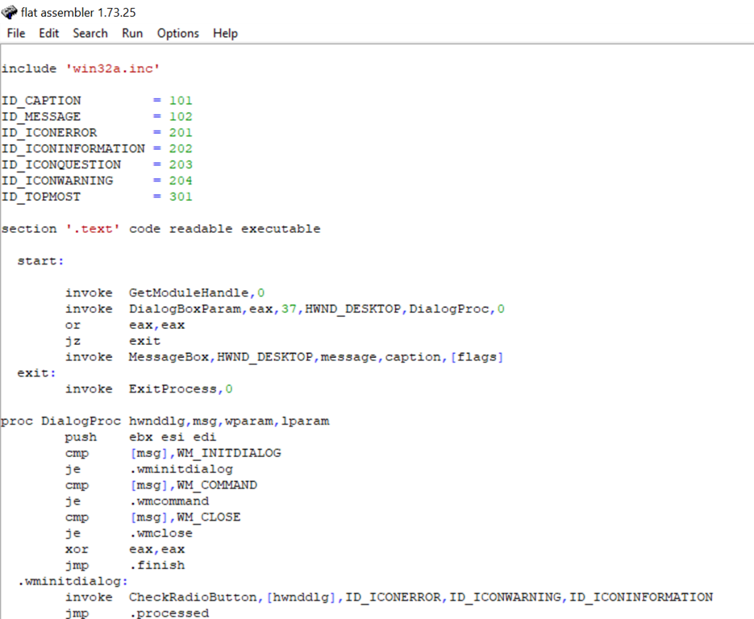

# ABCHomeWork1

## Карпунькин Ярослав БПИ191

## Программа 1
Научился создавать файлы в директории + писать внутри txt файла.
- **Код программы** 
   
- **Результат работы** 
   
  
## Программа 2
Стандартная программа, вывод Hello World!
- **Код программы** 
   
- **Результат работы** 
   
## Программа 3
Попробовал считывать текст из текстового файла и выводить на экран
- **Код программы** 
   
- **Результат работы** 
   
  
## Программа 4
Программа рисует градиентный квадрат.
- **Код программы** 
   
- **Результат работы** 
   
  
## Программа 5
Попробовал создать диалоговое окно.
- **Код программы** 
   
- **Результат работы** 
   

## Использованная литература/ интернет источники
1. Tomasz Grysztar. Flat Assembler Programmer’s Manual [Электронный
ресурс]. – Официальный сайт FASM. Режим доступа:
http://flatassembler.net/docs.php?article=manual

2. Vitali Kremez. FASM: Flat Assembler, also known as "FASM": Sample Code. [Электронный
ресурс] Режим доступа: https://vk-intel.org/2017/04/03/fasm-flat-assembler-also-known-as-fasm-sample-code/

3. Папка с исходниками, скаченная вместе с fasm.

4. https://wikiprograms.org/category/разработчику/ассемблеры/

